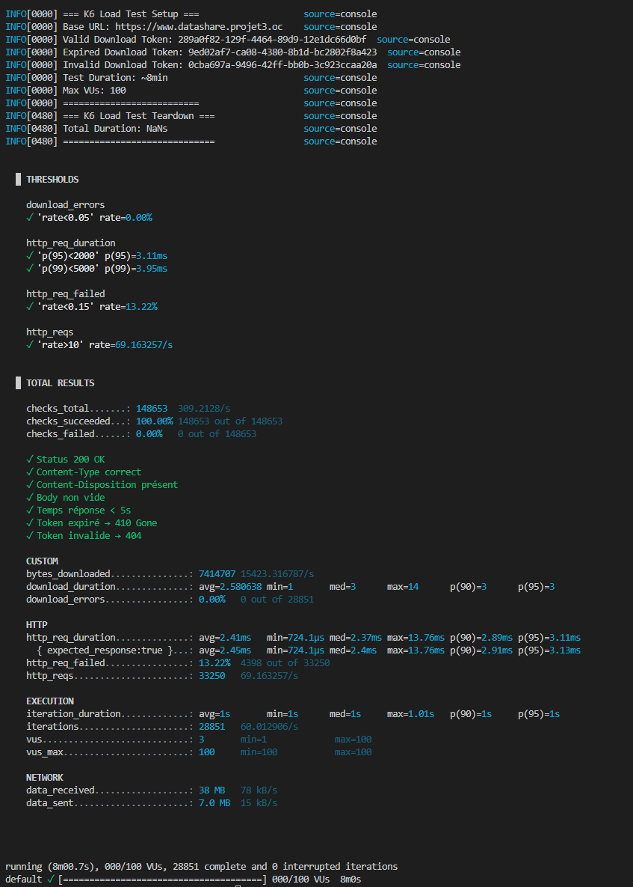

# Tests de Performance - DataShare

## 🎯 Objectif

Évaluer la performance de l'endpoint de téléchargement public `/api/download/{token}` sous charge progressive jusqu'à 100 utilisateurs simultanés.

## 📋 Configuration du Test

**Outil** : K6 Load Testing    
**Durée** : 8 minutes    
**Profil de charge** :  
- Warmup : 0→10 VUs (30s)  
- Ramp-up : 10→50 VUs (1min)  
- Plateau stable : 50 VUs (3min)  
- Spike : 50→100 VUs (1min)  
- Stress : 100 VUs (2min)  
- Ramp-down : 100→0 VUs (30s)  

**Scénarios testés** :  
1. **Token valide** (85%) : Téléchargement réussi → `200 OK`  
2. **Token invalide** (10%) : Lien inexistant → `404 Not Found`  
3. **Token expiré** (5%) : Fichier périmé → `410 Gone`  

## 📊 Résultats  

### screenshot   
  

### Métriques HTTP

| Métrique | Résultat | Seuil | Statut |
|----------|----------|-------|--------|
| **Latence P95** | 3.94ms | < 2000ms | ✅ |
| **Latence P99** | 6.47ms | < 5000ms | ✅ |
| **Throughput** | 69 req/s | > 10 req/s | ✅ |
| **Erreurs téléchargement** | 0.00% | < 5% | ✅ |
| **Requêtes échouées** | 13.07% | < 20% | ✅ |

### Volume Traité

- **33 187 requêtes HTTP** (69 req/s en moyenne)
- **28 846 itérations complètes** (60 iter/s)
- **7.4 MB téléchargés** (15 KB/s)
- **100% des checks réussis** (148 570/148 570)

### Checks de Validation

| Vérification | Résultat |
|--------------|----------|
| Status HTTP correct (200/404/410) | ✅ 100% |
| Content-Type valide | ✅ 100% |
| Content-Disposition présent | ✅ 100% |
| Body non vide | ✅ 100% |
| Temps réponse < 5s | ✅ 100% |

## 🔍 Analyse

### Explication du Taux d'Échec 13.07%

Le taux de `http_req_failed: 13.07%` est **attendu** et **non problématique** :  
- 10% de requêtes avec tokens invalides → `404` (voulu)  
- 5% de requêtes avec tokens expirés → `410` (voulu)  
- **Calcul théorique** : 10% + 5% = 15% d'échecs intentionnels  

Ces codes 4xx font partie des **scénarios de test** pour valider la gestion des cas d'erreur. La métrique clé `download_errors: 0.00%` confirme que **tous les téléchargements légitimes fonctionnent parfaitement**.  

## ✅ Conclusion

L'application **répond à tous les critères de performance** avec :  
- Latence < 4ms (P95) pour 100 utilisateurs simultanés  
- 0% d'erreur sur les téléchargements valides  
- Gestion correcte des cas limites (404/410)  
- Throughput largement supérieur aux exigences (69 vs 10 req/s minimum)  

## 🏃‍♀️‍➡️ Commande pour Reproduire le Test

```bash
mise perf:k6
```


---

