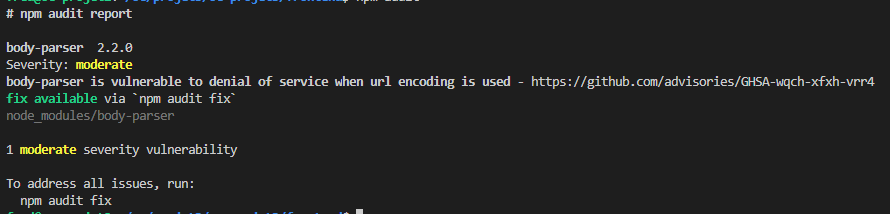
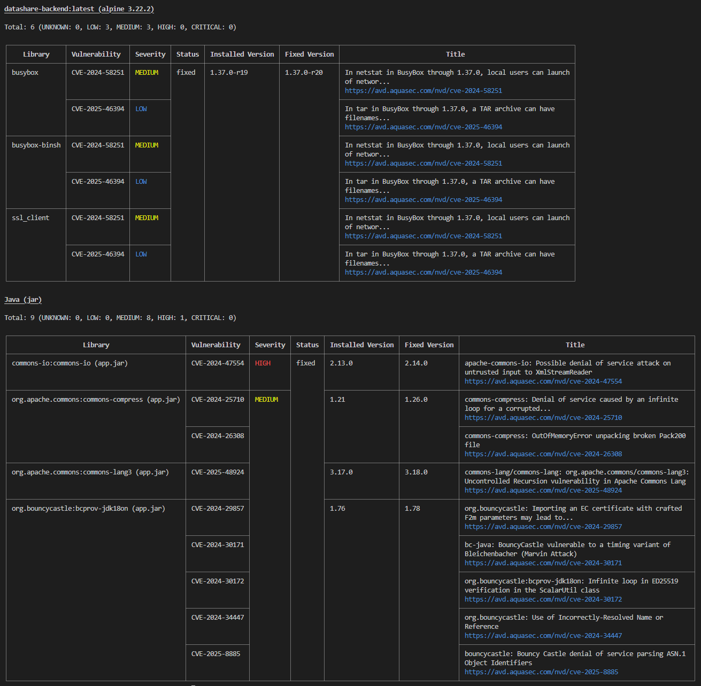

## Datashare - Sécurité de l'usine logicielle

Cette documentation décrit les pratiques et outils utilisés pour assurer la sécurité de l'usine logicielle du projet DataShare, couvrant à la fois le backend (Java/Spring Boot/Maven) et le frontend (Angular/TypeScript/NPM).

---

### Scan dépendances Backend - OWASP Dependency-Check

!!! info "Téléchargement base de données NVD"    
    Le téléchargement de la base de données NVD peut prendre **plusieurs minutes** lors du **premier scan**.     
    Si vous avez une **clef API NVD**, vous pouvez la configurer dans la variable d'environnement `NVD_API_KEY` pour éviter les limitations de requêtes.    
    La tâche mise **`mise dev:backend:cvescan`** charge **automatiquement** cette variable d'environnement depuis le fichier **`backend/.env.secrets`**.  

#### Commande exécutée
```bash
cd backend
mise dev:backend:cvescan
```

#### Rapport généré
Le rapport HTML est généré dans `backend/target/dependency-check-report.html`.  
[📊 Voir le rapport de scan dépendances OWASP Dependency-Check](backend-cve.html){:target="_blank"}

#### Cas pratique : Correction CVE-2021-26291 (maven-core)
Voir le document détaillé : [Cas Pratique : Correction CVE-2021-26291 (maven-core)](partials/security/cve-maven-core.md){:target="_blank"}

---

### Scan dépendances Frontend - npm audit

#### Commande exécutée
```bash
cd frontend
mise dev:frontend:cvescan
mise dev:frontend:cvescan --fix
```
#### Rapport généré
Sans outil supplémentaire, le rapport est affiché dans la console.  
Voici un exemple :  


#### Cas pratique : Correction CVE Frontend (body-parser)
Voir le document détaillé : [Cas Pratique : Correction CVE Frontend (body-parser)](partials/security/cve-frontend.md){:target="_blank"}

---

### Scan trivy des images Docker

#### Commande exécutée
```bash
mise infra:trivy
```
#### Rapport généré
Sans outil supplémentaire, le rapport est affiché dans la console.  
Voici un exemple :  


#### Cas pratique : Correction CVE Frontend (body-parser)
Voir le document détaillé : [Cas Pratique : Différents cas trivy)](partials/security/cve-docker-images.md){:target="_blank"}