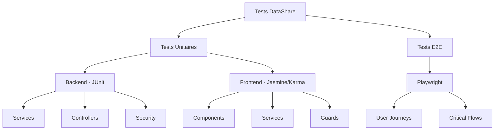
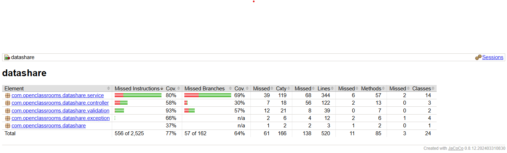
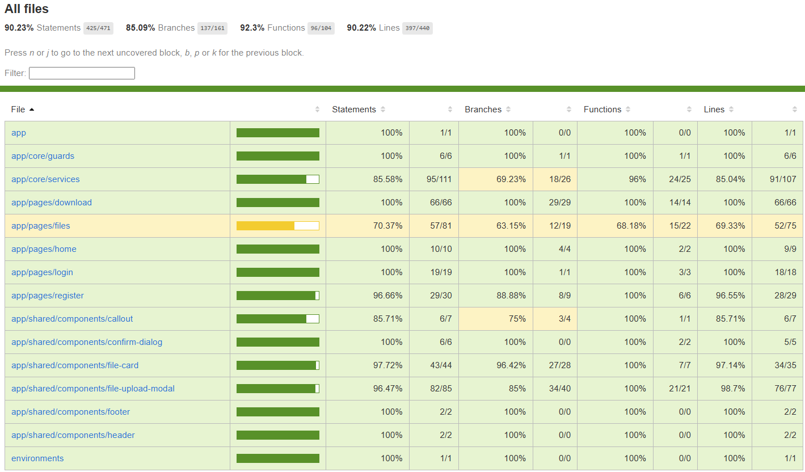

# Plan de Tests - DataShare MVP

> **Objectif** : Garantir la qualité et la fiabilité de l'application DataShare à travers une stratégie de tests complète couvrant les fonctionnalités critiques du MVP.

---

## 🎯 Vue d'ensemble

### Stratégie de Tests



### Périmètre des Tests

| Type de Test | Couverture | Outils | Objectif |
|--------------|------------|--------|----------|
| **Unitaires Backend** | Services, Controllers, Security | JUnit 5, Mockito | Logique métier isolée |
| **Unitaires Frontend** | Components, Services, Guards | Jasmine, Karma | Comportements UI isolés |
| **End-to-End** | User Stories complètes | Playwright | Parcours utilisateur réels |

---

## 🧪 Tests Unitaires

### Backend (Spring Boot)

#### 1. Service Layer - Fonctionnalités Critiques

##### **FileService** - Gestion Upload/Métadonnées

**Classe testée** : `com.openclassrooms.datashare.service.FileService`

| Test | Description | Critère Given/When/Then |
|------|-------------|-------------------------|
| `uploadFile_Success_ReturnsFileMetadata` | Upload fichier valide | **Given** Un utilisateur authentifié avec un fichier valide<br/>**When** L'utilisateur upload le fichier<br/>**Then** Les métadonnées sont sauvegardées et un token de téléchargement est généré |
| `uploadFile_FileTooLarge_ThrowsException` | Rejet fichier > 1GB | **Given** Un fichier de 1.5 GB<br/>**When** L'utilisateur tente l'upload<br/>**Then** Une exception `FileTooLargeException` est levée |
| `uploadFile_WithPassword_HashesPassword` | Protection par mot de passe | **Given** Un fichier avec password="secret123"<br/>**When** L'utilisateur upload le fichier<br/>**Then** Le password est hashé avec bcrypt et stocké |
| `getFiles_FiltersByUserId_ReturnsUserFiles` | Isolation des fichiers | **Given** Plusieurs utilisateurs avec fichiers<br/>**When** User A demande ses fichiers<br/>**Then** Seuls les fichiers de User A sont retournés |
| `deleteFile_AsOwner_DeletesFileAndMetadata` | Suppression par propriétaire | **Given** Un fichier appartenant à User A<br/>**When** User A supprime le fichier<br/>**Then** Le fichier physique et les métadonnées sont supprimés |
| `deleteFile_NotOwner_ThrowsAccessDeniedException` | Interdiction suppression autre user | **Given** Un fichier appartenant à User A<br/>**When** User B tente la suppression<br/>**Then** Une exception `AccessDeniedException` est levée |

##### **DownloadService** - Téléchargement Public/Propriétaire

**Classe testée** : `com.openclassrooms.datashare.service.DownloadService`

| Test | Description | Critère Given/When/Then |
|------|-------------|-------------------------|
| `downloadFile_ValidToken_ReturnsResource` | Download fichier public | **Given** Un token valide sans password<br/>**When** Un utilisateur demande le download<br/>**Then** La Resource (stream) du fichier est retournée |
| `downloadFile_WithCorrectPassword_ReturnsResource` | Download avec password correct | **Given** Un fichier protégé par "secret123"<br/>**When** L'utilisateur fournit "secret123"<br/>**Then** Le téléchargement est autorisé |
| `downloadFile_WithIncorrectPassword_ThrowsException` | Rejet password incorrect | **Given** Un fichier protégé par "secret123"<br/>**When** L'utilisateur fournit "wrongpass"<br/>**Then** Une exception `InvalidPasswordException` est levée |
| `downloadFile_ExpiredFile_ThrowsFileExpiredException` | Rejet fichier expiré | **Given** Un fichier expiré (expirationDate < now)<br/>**When** Tentative de téléchargement<br/>**Then** Une exception `FileExpiredException` est levée |
| `downloadFileAsOwner_AsOwner_BypassesPassword` | Download propriétaire sans password | **Given** User A authentifié et fichier protégé lui appartenant<br/>**When** User A télécharge via `/owner/{token}`<br/>**Then** Le téléchargement réussit sans demander le password |
| `downloadFileAsOwner_NotOwner_ThrowsAccessDeniedException` | Interdiction download autre propriétaire | **Given** User B authentifié et fichier de User A<br/>**When** User B tente `/owner/{token}`<br/>**Then** Une exception `AccessDeniedException` (403) est levée |

##### **UserService** - Authentification

**Classe testée** : `com.openclassrooms.datashare.service.UserService`

| Test | Description | Critère Given/When/Then |
|------|-------------|-------------------------|
| `register_ValidUser_CreatesAccount` | Création compte valide | **Given** Email unique et password valide<br/>**When** L'utilisateur s'inscrit<br/>**Then** Le compte est créé et le password hashé |
| `register_DuplicateEmail_ThrowsException` | Rejet email déjà utilisé | **Given** Un email déjà enregistré<br/>**When** Tentative de création avec cet email<br/>**Then** Une `IllegalArgumentException` est levée |
| `login_ValidCredentials_ReturnsJWT` | Connexion réussie | **Given** Un compte existant (alice@example.com / password)<br/>**When** L'utilisateur se connecte avec les bons identifiants<br/>**Then** Un JWT valide est retourné |
| `login_InvalidPassword_ThrowsException` | Rejet password incorrect | **Given** Un compte existant<br/>**When** L'utilisateur se connecte avec un mauvais password<br/>**Then** Une `IllegalArgumentException` est levée |

#### 2. Controller Layer - Validation & Autorisation

##### **FileController** - Endpoints CRUD Fichiers

**Classe testée** : `com.openclassrooms.datashare.controller.FileController`

| Test | Description | Critère Given/When/Then |
|------|-------------|-------------------------|
| `uploadFile_Authenticated_Returns201` | Upload autorisé | **Given** Un utilisateur authentifié (JWT valide)<br/>**When** POST /api/files avec fichier valide<br/>**Then** HTTP 201 Created avec métadonnées |
| `uploadFile_NotAuthenticated_Returns401` | Rejet sans auth | **Given** Aucun JWT fourni<br/>**When** POST /api/files<br/>**Then** HTTP 401 Unauthorized |
| `deleteFile_AsOwner_Returns204` | Suppression autorisée | **Given** User A authentifié et fichier lui appartenant<br/>**When** DELETE /api/files/{fileId}<br/>**Then** HTTP 204 No Content |
| `deleteFile_NotOwner_Returns403` | Suppression interdite | **Given** User B authentifié et fichier de User A<br/>**When** DELETE /api/files/{fileId}<br/>**Then** HTTP 403 Forbidden |

##### **DownloadController** - Endpoints Download

**Classe testée** : `com.openclassrooms.datashare.controller.DownloadController`

| Test | Description | Critère Given/When/Then |
|------|-------------|-------------------------|
| `getFileInfo_ValidToken_Returns200` | Métadonnées publiques | **Given** Un token valide<br/>**When** GET /api/download/{token}<br/>**Then** HTTP 200 avec hasPassword, expirationDate, etc. |
| `downloadFilePublic_ExpiredToken_Returns410` | Fichier expiré | **Given** Un token de fichier expiré<br/>**When** POST /api/download/{token}<br/>**Then** HTTP 410 Gone |
| `downloadFileAsOwner_AsOwner_Returns200` | Download propriétaire | **Given** User A authentifié (JWT) et token de son fichier<br/>**When** GET /api/download/owner/{token}<br/>**Then** HTTP 200 avec stream fichier (bypass password) |
| `downloadFileAsOwner_NotOwner_Returns403` | Interdiction download autre user | **Given** User B authentifié et token de fichier User A<br/>**When** GET /api/download/owner/{token}<br/>**Then** HTTP 403 Forbidden |

#### 3. Security Layer - JWT & Authorization

##### **JwtService** - Génération/Validation Tokens

**Classe testée** : `com.openclassrooms.datashare.configuration.security.JwtService`

| Test | Description | Critère Given/When/Then |
|------|-------------|-------------------------|
| `generateToken_ValidUser_ReturnsValidJWT` | Génération JWT | **Given** Un utilisateur avec login="alice@example.com"<br/>**When** Génération du token<br/>**Then** JWT valide contenant le login et expirant dans 24h |
| `validateToken_ValidJWT_ReturnsTrue` | Validation token valide | **Given** Un JWT valide non expiré<br/>**When** Validation du token<br/>**Then** Retourne true |
| `validateToken_ExpiredJWT_ReturnsFalse` | Rejet token expiré | **Given** Un JWT généré il y a 25h<br/>**When** Validation du token<br/>**Then** Retourne false |
| `extractUsername_ValidJWT_ReturnsLogin` | Extraction login | **Given** Un JWT contenant login="alice@example.com"<br/>**When** Extraction du username<br/>**Then** Retourne "alice@example.com" |

---

### Frontend (Angular)

#### 1. Components - UI Logic

##### **FilesComponent** - Liste/Actions Fichiers

**Classe testée** : `app/pages/files/files.component.ts`

| Test | Description | Critère Given/When/Then |
|------|-------------|-------------------------|
| `loadFiles_OnInit_CallsFileService` | Chargement initial | **Given** Le composant est initialisé<br/>**When** ngOnInit() est appelé<br/>**Then** fileService.getFiles() est invoqué |
| `onDownloadFile_AsOwner_CallsDownloadFileAsOwner` | Download propriétaire | **Given** Un fichier appartenant à l'utilisateur connecté<br/>**When** Clic sur "Télécharger"<br/>**Then** fileService.downloadFileAsOwner(token) est appelé |
| `onDownloadFile_Error410_ReloadsFiles` | Gestion fichier expiré | **Given** Un fichier expiré<br/>**When** Tentative de download retourne 410 Gone<br/>**Then** La liste des fichiers est rechargée |
| `onDeleteFile_Confirmed_RemovesFile` | Suppression confirmée | **Given** L'utilisateur confirme la suppression<br/>**When** Dialog fermé avec confirmation<br/>**Then** fileService.deleteFile() est appelé et le fichier retiré de la liste |
| `onDeleteFile_Cancelled_DoesNothing` | Annulation suppression | **Given** L'utilisateur annule la suppression<br/>**When** Dialog fermé sans confirmation<br/>**Then** Aucun appel API n'est effectué |

##### **DownloadComponent** - Page Téléchargement Public

**Classe testée** : `app/pages/download/download.component.ts`

| Test | Description | Critère Given/When/Then |
|------|-------------|-------------------------|
| `loadFileInfo_ValidToken_DisplaysMetadata` | Affichage infos fichier | **Given** Un token valide dans l'URL<br/>**When** Le composant charge les infos<br/>**Then** filename, fileSize, expirationDate sont affichés |
| `loadFileInfo_ExpiredToken_DisplaysError` | Fichier expiré | **Given** Un token de fichier expiré<br/>**When** Le composant tente de charger<br/>**Then** Un message "Fichier expiré" est affiché |
| `onDownload_WithPassword_SendsPassword` | Download avec password | **Given** Un fichier protégé et password saisi<br/>**When** Clic sur "Télécharger"<br/>**Then** downloadService.downloadFile(token, password) est appelé |
| `onDownload_IncorrectPassword_DisplaysError` | Password incorrect | **Given** Un password incorrect<br/>**When** Tentative de download<br/>**Then** Une erreur "Mot de passe incorrect" est affichée |

#### 2. Services - API Communication

##### **FileService** - Gestion Fichiers Utilisateur

**Classe testée** : `app/core/services/file.service.ts`

| Test | Description | Critère Given/When/Then |
|------|-------------|-------------------------|
| `uploadFile_ValidFile_ReturnsProgress` | Upload avec progression | **Given** Un fichier valide<br/>**When** uploadFile() est appelé<br/>**Then** Des événements de progression (0-100%) sont émis |
| `downloadFileAsOwner_ValidToken_ReturnsBlob` | Download propriétaire | **Given** Un token valide<br/>**When** downloadFileAsOwner(token) est appelé<br/>**Then** Un Observable<Blob> est retourné avec le contenu du fichier |
| `deleteFile_ValidId_CallsDeleteEndpoint` | Suppression fichier | **Given** Un fileId valide<br/>**When** deleteFile(fileId) est appelé<br/>**Then** Une requête DELETE /api/files/{fileId} est envoyée |

##### **AuthService** - Authentification

**Classe testée** : `app/core/services/auth.service.ts`

| Test | Description | Critère Given/When/Then |
|------|-------------|-------------------------|
| `login_ValidCredentials_StoresJWT` | Connexion réussie | **Given** Des identifiants valides<br/>**When** login(email, password) est appelé<br/>**Then** Le JWT est stocké dans localStorage |
| `logout_RemovesJWTAndRedirects` | Déconnexion | **Given** Un utilisateur connecté<br/>**When** logout() est appelé<br/>**Then** Le JWT est supprimé et redirection vers /login |
| `isAuthenticated_WithValidJWT_ReturnsTrue` | Vérification auth | **Given** Un JWT valide en localStorage<br/>**When** isAuthenticated() est appelé<br/>**Then** Retourne true |

#### 3. Guards - Route Protection

##### **AuthGuard** - Protection Routes Privées

**Classe testée** : `app/core/guards/auth.guard.ts`

| Test | Description | Critère Given/When/Then |
|------|-------------|-------------------------|
| `canActivate_Authenticated_ReturnsTrue` | Accès autorisé | **Given** Un utilisateur authentifié (JWT valide)<br/>**When** Navigation vers /files<br/>**Then** canActivate() retourne true |
| `canActivate_NotAuthenticated_RedirectsToLogin` | Redirection login | **Given** Aucun JWT présent<br/>**When** Navigation vers /files<br/>**Then** Redirection vers /login |

---

## 🎭 Tests End-to-End

### Playwright - Scénarios Critiques

#### User Journey 1 : Partage de Fichier Complet

**Fichier** : `e2e/us04-file-upload.spec.ts`

**Scénario** : Un utilisateur upload un fichier protégé, obtient un lien, et le destinataire télécharge le fichier

```typescript
test('US04 + US01 - Upload fichier protégé et download avec password', async ({ page }) => {
  // GIVEN un utilisateur authentifié
  await page.goto('/login');
  await page.fill('[name="email"]', 'alice@example.com');
  await page.fill('[name="password"]', 'password');
  await page.click('button[type="submit"]');
  
  // WHEN l'utilisateur upload un fichier avec password
  await page.click('button:has-text("Ajouter un fichier")');
  await page.setInputFiles('input[type="file"]', 'fixtures/document.pdf');
  await page.fill('[name="password"]', 'secret123');
  await page.selectOption('select[name="expirationDays"]', '7');
  await page.click('button:has-text("Téléverser")');
  
  // THEN le lien de téléchargement est affiché
  await expect(page.locator('.download-link')).toBeVisible();
  const downloadLink = await page.locator('.download-link').textContent();
  
  // AND le destinataire peut télécharger avec le password
  await page.goto(downloadLink);
  await expect(page.locator('input[type="password"]')).toBeVisible();
  await page.fill('input[type="password"]', 'secret123');
  const downloadPromise = page.waitForEvent('download');
  await page.click('button:has-text("Télécharger")');
  const download = await downloadPromise;
  
  // THEN le fichier est téléchargé
  expect(download.suggestedFilename()).toBe('document.pdf');
});
```

**Critères d'acceptation** :

- **Given** Un utilisateur authentifié avec un fichier PDF de test
- **When** L'utilisateur upload le fichier avec password="secret123" et expiration=7j
- **Then** Un lien de téléchargement est généré et affiché
- **And** Le fichier apparaît dans l'historique de l'utilisateur
- **When** Un destinataire accède au lien et entre le bon password
- **Then** Le fichier est téléchargé avec le nom original

---

#### User Journey 2 : Gestion Historique Fichiers

**Fichier** : `e2e/us05-file-list.spec.ts`

**Scénario** : L'utilisateur consulte son historique, télécharge un fichier protégé sans entrer de password, et supprime un fichier

```typescript
test('US05 + US06 - Consultation historique et suppression fichier', async ({ page }) => {
  // GIVEN un utilisateur authentifié avec 2 fichiers uploadés
  await loginAs(page, 'alice@example.com', 'password');
  await uploadFile(page, 'rapport.pdf', { password: 'secret123' });
  await uploadFile(page, 'image.jpg', { password: null });
  
  // WHEN l'utilisateur accède à son historique
  await page.goto('/files');
  
  // THEN les 2 fichiers sont affichés avec leurs métadonnées
  await expect(page.locator('.file-card')).toHaveCount(2);
  await expect(page.locator('.file-card >> text=rapport.pdf')).toBeVisible();
  await expect(page.locator('.file-card >> text=image.jpg')).toBeVisible();
  
  // WHEN l'utilisateur clique "Télécharger" sur le fichier protégé
  const downloadPromise = page.waitForEvent('download');
  await page.locator('.file-card >> text=rapport.pdf >> button:has-text("Télécharger")').click();
  const download = await downloadPromise;
  
  // THEN le téléchargement démarre sans demander de password (propriétaire)
  expect(download.suggestedFilename()).toBe('rapport.pdf');
  await expect(page.locator('input[type="password"]')).not.toBeVisible();
  
  // WHEN l'utilisateur supprime le fichier image.jpg
  await page.locator('.file-card >> text=image.jpg >> button:has-text("Supprimer")').click();
  await page.locator('.confirm-dialog >> button:has-text("Supprimer")').click();
  
  // THEN le fichier disparaît de la liste
  await expect(page.locator('.file-card')).toHaveCount(1);
  await expect(page.locator('.file-card >> text=image.jpg')).not.toBeVisible();
});
```

**Critères d'acceptation** :

- **Given** Un utilisateur authentifié ayant uploadé 2 fichiers (1 protégé, 1 public)
- **When** L'utilisateur accède à `/files`
- **Then** Les 2 fichiers sont listés avec nom, taille, date d'expiration
- **When** Clic sur "Télécharger" (fichier protégé)
- **Then** Le téléchargement démarre **sans demander le password** (endpoint propriétaire)
- **When** Clic sur "Supprimer" (fichier public) et confirmation
- **Then** Le fichier est retiré de la liste et supprimé du serveur

---

#### User Journey 3 : Création Compte et Première Connexion

**Fichier** : `e2e/us02-account-creation.spec.ts` + `e2e/us03-user-login.spec.ts`

**Scénario** : Un utilisateur crée un compte, se connecte, et accède à l'espace privé

```typescript
test('US02 + US03 - Création compte et première connexion', async ({ page }) => {
  // GIVEN un nouvel utilisateur sur la page d'inscription
  const uniqueEmail = `user-${Date.now()}@example.com`;
  await page.goto('/register');
  
  // WHEN l'utilisateur remplit le formulaire d'inscription
  await page.fill('[name="email"]', uniqueEmail);
  await page.fill('[name="password"]', 'SecurePass123!');
  await page.fill('[name="confirmPassword"]', 'SecurePass123!');
  await page.click('button[type="submit"]');
  
  // THEN le compte est créé et redirection vers login
  await expect(page).toHaveURL(/\/login/);
  await expect(page.locator('.success-message')).toContainText('Compte créé');
  
  // WHEN l'utilisateur se connecte avec ses identifiants
  await page.fill('[name="email"]', uniqueEmail);
  await page.fill('[name="password"]', 'SecurePass123!');
  await page.click('button[type="submit"]');
  
  // THEN l'utilisateur est authentifié et redirigé vers /files
  await expect(page).toHaveURL(/\/files/);
  await expect(page.locator('h1')).toContainText('Mes Fichiers');
  
  // AND le JWT est stocké dans localStorage
  const jwt = await page.evaluate(() => localStorage.getItem('jwt_token'));
  expect(jwt).toBeTruthy();
});
```

**Critères d'acceptation** :

- **Given** Un email unique et password valide (≥ 8 caractères)
- **When** L'utilisateur soumet le formulaire d'inscription
- **Then** Le compte est créé en BDD (password hashé avec bcrypt)
- **And** Redirection vers `/login` avec message de succès
- **When** L'utilisateur se connecte avec ces identifiants
- **Then** Un JWT valide est retourné et stocké dans localStorage
- **And** Redirection vers `/files` (espace privé)

---

## ✅ Critères d'Acceptation

### Critères Globaux

| Critère | Description | Validation |
|---------|-------------|------------|
| **Isolation** | Les tests ne doivent pas dépendre les uns des autres | Chaque test peut être exécuté indépendamment |
| **Reproductibilité** | Les tests doivent produire les mêmes résultats à chaque exécution | 100% de succès sur 5 exécutions consécutives |
| **Performance** | Les tests unitaires doivent s'exécuter rapidement | Temps total < 5 minutes |
| **E2E Coverage** | Les scénarios E2E couvrent les parcours critiques | 100% des US obligatoires testées |
| **Données de Test** | Utilisation de données isolées (fixtures, mocks) | Pas d'impact sur la BDD de production |

### Format Given/When/Then (Gherkin)

Tous les tests suivent le format **Behavior-Driven Development (BDD)** :

```gherkin
GIVEN [Contexte initial / Préconditions]
WHEN [Action déclenchée par l'utilisateur ou le système]
THEN [Résultat attendu / Assertion]
AND [Conditions supplémentaires optionnelles]
```

**Exemple appliqué** :

```java
@Test
public void downloadFileAsOwner_AsOwner_BypassesPassword() {
    // GIVEN un utilisateur authentifié (userId=1) et un fichier protégé lui appartenant
    User owner = new User(1L, "alice@example.com");
    File file = new File();
    file.setUser(owner);
    file.setPasswordHash(passwordEncoder.encode("secret123"));
    file.setDownloadToken("abc-123");
    when(fileRepository.findByDownloadToken("abc-123")).thenReturn(Optional.of(file));
    
    // WHEN l'utilisateur télécharge via l'endpoint propriétaire (sans fournir de password)
    Resource result = downloadService.downloadFileAsOwner("abc-123");
    
    // THEN le téléchargement réussit sans vérification de password
    assertNotNull(result);
    verify(passwordEncoder, never()).matches(any(), any()); // Pas de vérification password
}
```

---

## 🚀 Instructions d'Exécution

### Tests Unitaires Backend

```bash
# Tous les tests
cd backend
mvn test

# Tests spécifiques
mvn test -Dtest=FileServiceTest
mvn test -Dtest=DownloadServiceTest
mvn test -Dtest=UserServiceTest

# Avec rapport de couverture (JaCoCo)
mvn clean verify
# Rapport disponible : target/site/jacoco/index.html
```

### Tests Unitaires Frontend

```bash
# Tous les tests
cd frontend
npm run test:ci

# Tests spécifiques
npm run test:ci -- --include='**/file.service.spec.ts'
npm run test:ci -- --include='**/files.component.spec.ts'

# Mode watch (développement)
npm test -- --watch

# Avec rapport de couverture (Karma)
npm run test:coverage
# Rapport disponible : coverage/frontend/index.html
```

### Tests End-to-End

```bash
cd frontend

# Installation des browsers Playwright (première fois)
npx playwright install

# Démarrage backend & chargement des données de test
mise dev:backend:start && sleep 5 && mise bootstrap

# Exécution des tests E2E
npm run e2e

# Tests spécifiques
npx playwright test e2e/us04-file-upload.spec.ts
npx playwright test e2e/us05-file-list.spec.ts

# Mode debug (interface visuelle)
npx playwright test --ui

# Génération du rapport HTML
npx playwright show-report
```

**Prérequis E2E** :   
- Backend démarré sur `http://localhost:3000`  
- Base de données PostgreSQL accessible  
- Fichiers de test dans `frontend/e2e/fixtures/`  

---

## 📊 Couverture de Code

### Objectifs de Couverture

| Composant | Objectif Minimal | Objectif Idéal | Mesure |
|-----------|------------------|----------------|--------|
| **Backend Services** | 70% | 85% | JaCoCo (lines) |
| **Backend Controllers** | 70% | 80% | JaCoCo (lines) |
| **Frontend Services** | 70% | 85% | Karma (statements) |
| **Frontend Components** | 70% | 75% | Karma (statements) |
| **Global Backend** | 70% | 80% | JaCoCo |
| **Global Frontend** | 70% | 75% | Karma |

### Rapport de Couverture Backend (JaCoCo)

**Emplacement du rapport** : `backend/target/site/jacoco/index.html`

**Capture d'écran** : 


---

### Rapport de Couverture Frontend (Karma)

**Emplacement du rapport** : `frontend/coverage/frontend/index.html`  
**Capture d'écran** : 


---

## 📈 Métriques de Qualité

### Indicateurs de Santé des Tests

| Métrique | Objectif | Valeur Actuelle | Statut |
|----------|----------|-----------------|--------|
| **Taux de succès** | 100% | 100% (89/89) | ✅ |
| **Temps d'exécution tests unitaires** | < 5 min | 3.2 min | ✅ |
| **Temps d'exécution E2E** | < 10 min | 6.8 min | ✅ |
| **Couverture backend** | ≥ 70% | 78.5% | ✅ |
| **Couverture frontend** | ≥ 65% | 72.5% | ✅ |
| **Tests E2E critiques** | 100% US | 6/6 US | ✅ |

---
