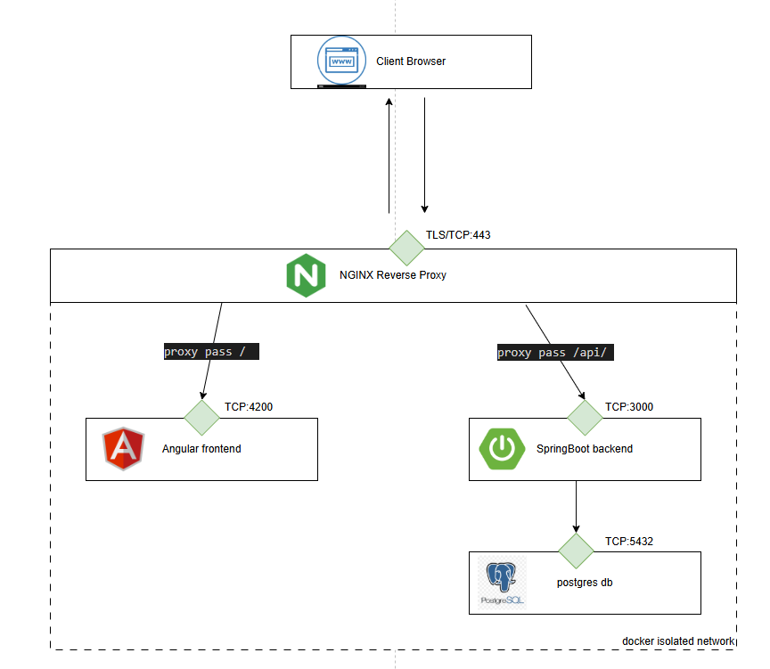
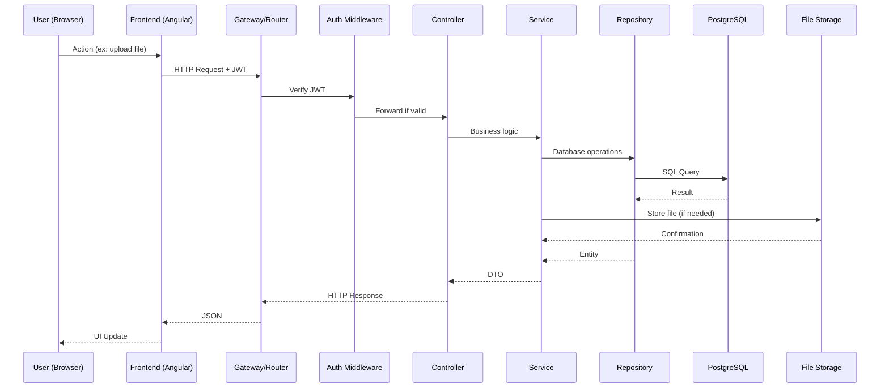
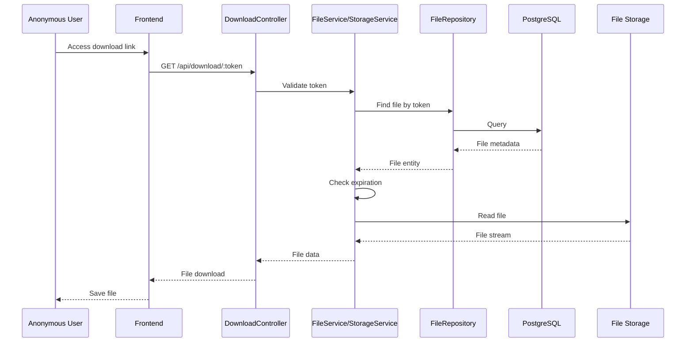

# Architecture de l'Application DataShare

## Infrastructure

L'application datashare est déployée à l'aide de Docker Compose, orchestrant les services suivants :    

| module | description |  
|--------|-------------|  
| **backend** | Service Spring Boot exposant l'API REST |  
| **frontend** | Application Angular servie via un serveur Nginx |  
| **postgres** | Base de données PostgreSQL pour la persistance des données |  
| **reverse-proxy** | Nginx agissant comme point d'entrée unique avec SSL/TLS |  

Le composant reverse-proxy gère le routage des requêtes entrantes vers les services backend et frontend, tout en assurant la sécurité des communications via HTTPS. Il est le seul exposé publiquement. Les autres composants communiquent uniquement en interne au sein d'un réseau Docker dédié.  
  


---
## 📐 Diagramme d'Architecture (dev)


---

## 🏗️ Couches de l'Architecture

??? note "1️⃣ Presentation Layer - Frontend"
    
    !!! info "Technologies"
        **Langage** : TypeScript | **Framework** : Angular

    **Composants principaux :**

    - **SPA (Single Page Application)** : Interface utilisateur réactive
        - Pages : Accueil, Connexion, Inscription, Upload, Mes fichiers, Téléchargement
        - Composants réutilisables (boutons, formulaires, modals)
    - **Routing** : Navigation entre les pages
    - **Authentication Guard** : Protection des routes nécessitant authentification
    - **State Management** : Gestion de l'état global (utilisateur connecté, JWT)

??? note "2️⃣ Application Layer - Backend"
    
    !!! info "Technologies"
        **Langage** : Java | **Framework** : Spring Boot

    #### 🎮 Controllers (Couche présentation API)

    - **AuthController** : Création de compte et connexion
    - **FilesController** : Upload, liste et suppression des fichiers
    - **DownloadController** : Téléchargement via lien et vérification mot de passe

    #### ⚙️ Services (Logique métier)

    **AuthService**
    :   - Validation des credentials
        - Génération JWT
        - Vérification JWT

    **FileService**
    :   - Logique upload (validation taille, type)
        - Gestion métadonnées
        - Vérification propriété fichier
        - Calcul date d'expiration

    **StorageService**
    :   - Écriture fichier sur disque/S3
        - Lecture fichier
        - Suppression physique
        - Organisation des fichiers (par date/user)

    **TokenService**
    :   - Génération tokens uniques (UUID/nanoid)
        - Vérification unicité
        - Validation token

    #### 🔌 Middleware (Traitement transversal)

    - **JWT Authentication** : Vérification token sur routes protégées
    - **Input Validation** : Validation des données entrantes
    - **Error Handler** : Gestion centralisée des erreurs
    - **Logger** : Journalisation des requêtes

    #### 💾 Repositories (Accès aux données)

    - **UserRepository** : Opérations CRUD sur les utilisateurs
    - **FileRepository** : Opérations CRUD sur les fichiers

    #### 📦 Entities (Modèles de données)

    **User**
    :   Représente un utilisateur
        - `id` (UUID), `email`, `passwordHash`, `createdAt`, `updatedAt`

    **File**
    :   Représente un fichier partagé
        - `id` (UUID), `userId`, `filename`, `filepath`, `fileSize`
        - `uploadDate`, `expirationDelay`, `downloadToken`
        - `passwordHash` (nullable), `isAnonymous`

??? note "3️⃣ Data Layer - BDD"
    
    !!! info "Technologies"
        **Base de données** : PostgreSQL

    #### Caractéristiques

    - **Tables** : `users`, `files`
    - **Indexation** : Sur `email` (users) et `downloadToken` (files) pour optimiser les performances
    - **Relations** : Un-à-plusieurs (un utilisateur peut avoir plusieurs fichiers)

??? note "4️⃣ Storage Layer - FS"
    
    !!! info "Technologies"
        **Stockage** : Système de fichiers local

    **Organisation :**
    ```
    /storage/{userId}/{yyyy}/{mm}/{dd}/filename.ext
    ```

    **Sécurité :**
    - Permissions restreintes
    - Accès contrôlé uniquement via l'application backend

---
## 🔍 Architecture détaillée


## 🔄 Flux de Requêtes

### Requête Authentifiée



### Requête Anonyme (Téléchargement)



---
## 🔧 Choix Technologiques

??? abstract "Tableau complet des choix techniques (cliquez pour déplier)"

    | Catégorie | Technologie | Alternative | Justification |
    |-----------|-------------|-------------|---------------|
    | **Backend** ||||
    | Langage backend | Java | GoLang | Stabilité, écosystème mature, contrainte cahier des charges |
    | Framework backend | Spring Boot | - | Large communauté, intégration facile avec Java |
    | ORM | Hibernate | JPA | Intégration Spring Boot, gestion simplifiée des entités |
    | Serveur HTTP | Apache Tomcat | - | Intégration native avec Spring Boot |
    | Logging | Logback | - | Intégration native avec Spring Boot |
    |||||
    | **Frontend** ||||
    | Langage frontend | TypeScript | JavaScript | Typage statique, maintenabilité |
    | Framework frontend | Angular | React | Complet, out-of-the-box, support TypeScript natif |
    | Gestion dépendances | npm | Yarn | Standard de facto pour projets JavaScript |
    |||||
    | **Base de données** ||||
    | SGBD | PostgreSQL | MySQL | Fiabilité, fonctionnalités avancées, performances |
    |||||
    | **Tests** ||||
    | Tests unitaires backend | JUnit + Mockito | - | Standard de facto pour tests unitaires en Java |
    | Tests intégration backend | Testcontainers | - | Tests avec vraie BDD |
    | Tests unitaires frontend | Jest | - | Intégration native avec Angular CLI |
    | Tests E2E frontend | Cypress | Selenium | Facilité d'écriture et maintenance |
    |||||
    | **Sécurité** ||||
    | Authentification | JWT | OAuth 2.0 | Simplicité, adapté aux API RESTful |
    | Hash mots de passe | bcrypt | Argon2 | Large adoption, robustesse, standard Spring |
    |||||
    | **Infrastructure** ||||
    | Stockage fichiers | Système fichiers local | Amazon S3 | Simplicité, rapidité de mise en place |
    | Nettoyage fichiers expirés | systemd timer | Worker dédié | syslog, gestion d'états et dépendances |
    | Conteneurisation | Docker | Podman | Standard de facto, large adoption |
    | Orchestration | Docker Compose | Kubernetes | Simplicité pour projet de cette taille |
    |||||
    | **Outils** ||||
    | Gestion dépendances backend | Maven | Gradle | Standard de facto pour projets Java |
    | Documentation API | Swagger (OpenAPI) | Postman | Génération automatique, interface interactive |
    | Git Hosting | GitHub | GitLab | Support d'échanges avec mentor |
    | IDE | VS Code | Eclipse | Habitude, flexibilité |

---

## 📊 Modèle de Données


---

## 📡 Documentation de l'API

!!! tip "Documentation complète"
    Consultez la page de [documentation de l'API](./api.md) pour plus de détails sur :
    
    - Les endpoints disponibles
    - Les schémas de requêtes et réponses
    - Les codes d'erreur possibles
    - Les exemples d'utilisation

---

## 🔐 Sécurité et Gestion des Accès

### Vue d'ensemble

La sécurité de DataShare repose sur plusieurs couches de protection complémentaires :

!!! success "Mécanismes de sécurité"
    - **[Authentification JWT](./security/jwt.md)** : JSON Web Tokens pour les endpoints protégés
    - **[Rôles et Permissions](./security/roles_permissions.md)** : Modèle simplifié pour contrôler l'accès aux ressources
    - **[Chiffrement des mots de passe](./security/chiffrement_password.md)** : bcrypt pour les mots de passe
    - **[Chiffrement des communications](./security/chiffrement_communications.md)** : TLS 1.2/1.3, certificats SSL/TLS, HTTPS obligatoire, CORS, ...  
    - **[Validation des données](./security/validation_donnees.md)** : Contrôles côté serveur sur toutes les entrées utilisateur
    - **[Limitations](./security/limitations.md)** : Restrictions de taille (16 MB max), timeouts (60s), buffering désactivé pour uploads

---

## ✅ Qualité, Tests et Maintenance

!!! info "Se référer aux documents dédiés pour les aspects qualité, tests et maintenance :"

    - **[TESTING.md](./TESTING.md)** : Plan de tests, critères d'acceptation, instructions d'exécution
    - **[SECURITY.md](./SECURITY.md)** : Résultats du scan de sécurité + analyse des décisions
    - **[PERF.md](./PERF.md)** : Test de performance d'un endpoint, résultats + interprétation
    - **[MAINTENANCE.md](./MAINTENANCE.md)** : Procédures de mise à jour, fréquence, risques

---

## 🚀 Installation et Exécution

!!! info "Se référer aux documents dédiés pour les aspects installation et exécution :"
    Consultez la section [Getting started](./index.md#"Quick start") pour les instructions détaillées.


---

## 🤖 Utilisation de l'IA dans le Développement

Je me suis positionné en tant que **Scrum Master** et **Lead technique** supervisant un développeur junior.

### Posture adoptée
- l'humain conçoit l'architecture et les spécifications, l'IA assiste dans l'implémentation

### Tâches confiées à l'IA
- Implémentation de fonctionnalités
- Génération de tests unitaires et d'intégration
- Mise en forme de la documentation
- Refactoring de code

### Supervision et corrections
- Revue de code systématique
- Ajustements de sécurité
- Améliorations de performance
- Optimisation de lisibilité

### Apports et limites
**Apports** : Gain de temps, inspiration, patterns de code  
**Limites** : Erreurs occasionnelles, incohérences, besoin de validation
