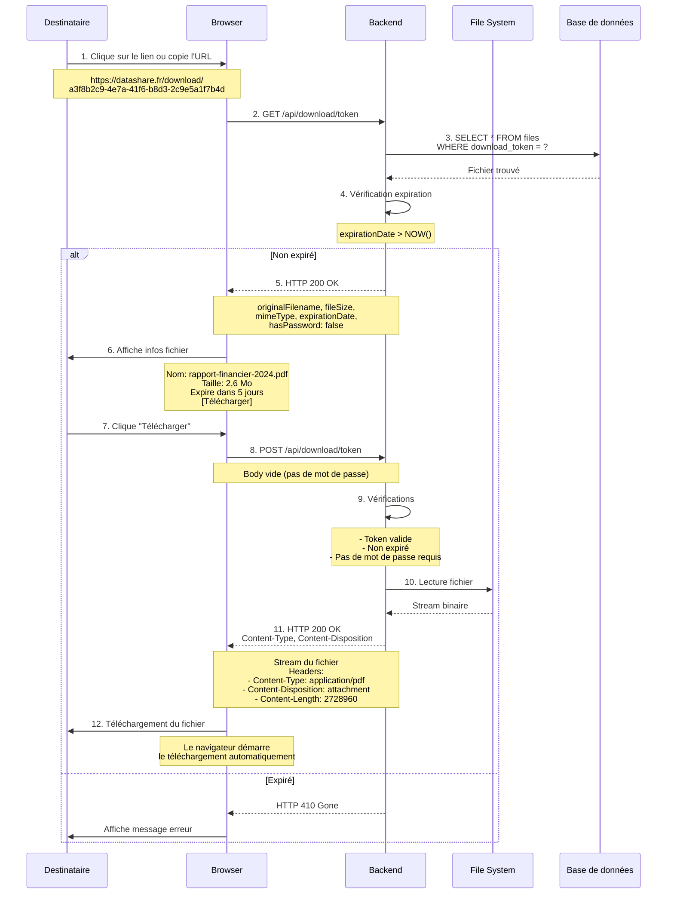
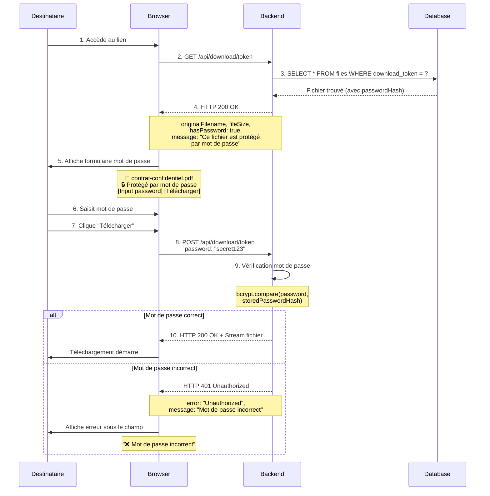

# US01 - Téléchargement via Lien

## 📋 Description

**User Story :** En tant que destinataire (anonyme ou authentifié), je veux télécharger un fichier via le lien partagé pour accéder au contenu.

!!! info "Informations"
    **Acteur** : N'importe qui avec le lien  
    **Objectif** : Télécharger un fichier partagé  
    **Prérequis** : Avoir le lien de téléchargement  
    **Résultat attendu** : Fichier téléchargé sur l'appareil

---

## 🔄 Flux Nominal (Sans Mot de Passe)



---

## 🔐 Flux avec Mot de Passe



---

## 📝 Étapes Détaillées

### Scénario A : Fichier sans mot de passe

| Étape | Action utilisateur | Réponse système | Écran |
|-------|-------------------|-----------------|-------|
| 1 | Clique sur le lien reçu | Chargement page | - |
| 2 | - | Récupération infos fichier | Page téléchargement |
| 3 | Voit nom, taille, expiration | - | - |
| 4 | Clique "Télécharger" | Démarre téléchargement | - |
| 5 | - | Fichier téléchargé dans Downloads | - |

### Scénario B : Fichier avec mot de passe

| Étape | Action utilisateur | Réponse système | Écran |
|-------|-------------------|-----------------|-------|
| 1 | Clique sur le lien reçu | Chargement page | - |
| 2 | - | Affiche infos + formulaire password | Page avec formulaire |
| 3 | Saisit mot de passe | - | - |
| 4 | Clique "Télécharger" | Vérification password | - |
| 5 | - | Si OK : téléchargement | - |
| 6 | - | Si KO : message erreur | Erreur sous champ |

---

## 📦 API Endpoints

### GET /api/download/{token}
**Description** : Récupère les informations du fichier sans le télécharger

**Réponse Success (200 OK) - Sans mot de passe :**
```json
{
  "originalFilename": "rapport-financier-2024.pdf",
  "fileSize": 2728960,
  "mimeType": "application/pdf",
  "expirationDate": "2025-02-15T10:30:00Z",
  "hasPassword": false,
  "downloadCount": 12
}
```

**Réponse Success (200 OK) - Avec mot de passe :**
```json
{
  "originalFilename": "contrat-confidentiel.pdf",
  "fileSize": 1524288,
  "mimeType": "application/pdf",
  "expirationDate": "2025-02-20T14:00:00Z",
  "hasPassword": true,
  "message": "Ce fichier est protégé par mot de passe"
}
```

---

### POST /api/download/{token}
**Description** : Télécharge le fichier (avec mot de passe optionnel)

**Request Body (si protégé) :**
```json
{
  "password": "secret123"
}
```

**Response Headers (200 OK) :**
```http
HTTP/1.1 200 OK
Content-Type: application/pdf
Content-Disposition: attachment; filename="rapport-financier-2024.pdf"
Content-Length: 2728960
Cache-Control: no-cache, no-store, must-revalidate
```

**Response Body :** Stream binaire du fichier

---

## ⚠️ Cas d'Erreur

### A. Lien expiré

!!! danger "Erreur 410 Gone"
    ```json
    {
      "error": "Gone",
      "message": "Ce fichier a expiré et n'est plus disponible",
      "expirationDate": "2025-01-14T10:45:00Z"
    }
    ```

---

### B. Token invalide

!!! danger "Erreur 404 Not Found"
    ```json
    {
      "error": "Not Found",
      "message": "Lien de téléchargement invalide ou fichier non trouvé"
    }
    ```

---

### C. Mot de passe incorrect (Rate Limiting)

!!! warning "Limitation des tentatives"
    **Tentative 1-3 :**
    ```json
    {
      "error": "Unauthorized",
      "message": "Mot de passe incorrect",
      "remainingAttempts": 2
    }
    ```
    
    **Après 3 tentatives échouées :**
    ```json
    {
      "error": "Too Many Requests",
      "message": "Trop de tentatives. Réessayez dans 15 minutes",
      "retryAfter": 900
    }
    ```
---

### D. Fichier supprimé

!!! warning "Erreur 404 Not Found"
    ```json
    {
      "error": "Not Found",
      "message": "Ce fichier a été supprimé par son propriétaire"
    }
    ```

---

## 🔐 Sécurité

!!! success "Mesures de sécurité appliquées"
    - ✅ Tokens de téléchargement uniques et aléatoires (UUID v4)
    - ✅ Vérification de l'expiration côté serveur
    - ✅ Hash bcrypt pour les mots de passe de protection
    - ✅ Rate limiting : 3 tentatives de mot de passe par IP/token (15 min)
    - ✅ Rate limiting : 10 téléchargements par minute par IP
    - ✅ Pas d'énumération de fichiers possible (tokens aléatoires)
    - ✅ Headers sécurisés (Cache-Control, X-Content-Type-Options)
    - ✅ Logging des téléchargements (IP, timestamp, user-agent)

---

## 🧪 Critères d'Acceptation

!!! tip "Tests à valider"
    - [ ] Un fichier public peut être téléchargé sans mot de passe
    - [ ] Un fichier protégé affiche le formulaire de mot de passe
    - [ ] Le mot de passe correct permet le téléchargement
    - [ ] Un mot de passe incorrect affiche une erreur claire
    - [ ] Après 3 tentatives échouées, l'accès est bloqué 15 minutes
    - [ ] Un fichier expiré retourne une erreur 410 Gone
    - [ ] Un token invalide retourne une erreur 404 Not Found
    - [ ] Les headers HTTP sont corrects (Content-Type, Content-Disposition)
    - [ ] Le nom du fichier téléchargé correspond à l'original
    - [ ] Les statistiques de téléchargement sont mises à jour
    - [ ] La page est accessible sans authentification
    - [ ] Le rate limiting fonctionne (10 téléchargements/min/IP)