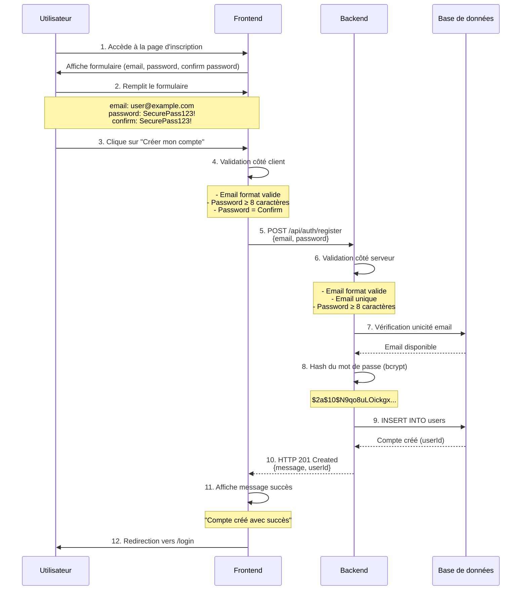
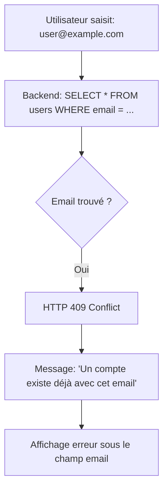

# US02 - Création de Compte

## 📋 Description

**User Story :** En tant qu'utilisateur non authentifié, je veux créer un compte pour pouvoir uploader et gérer des fichiers.

!!! info "Informations"
    **Acteur** : Utilisateur non authentifié  
    **Objectif** : Créer un compte avec email et mot de passe  
    **Prérequis** : Aucun  
    **Résultat attendu** : Compte créé, redirection vers la page de connexion

---

## 🔄 Diagramme de Séquence



---

## 📝 Étapes Détaillées

| Étape | Action utilisateur | Réponse système | Écran |
|-------|-------------------|-----------------|-------|
| 1 | Clique sur "Créer un compte" | Affiche formulaire d'inscription | Écran inscription |
| 2 | Saisit email | Validation format en temps réel | - |
| 3 | Saisit mot de passe | Indicateur de force affiché | - |
| 4 | Confirme mot de passe | Vérification correspondance | - |
| 5 | Clique "Créer mon compte" | Désactive bouton, affiche loader | - |
| 6 | - | Validation backend + création compte | - |
| 7 | - | Message succès + redirection | Page connexion |

---

## ⚠️ Cas d'Erreur

### A. Email déjà utilisé



**Réponse API :**
```json
{
  "error": "Conflict",
  "message": "Un compte existe déjà avec cet email",
  "timestamp": "2025-01-15T10:30:00Z"
}
```

**Affichage frontend :** Message d'erreur sous le champ email

---

### B. Mot de passe trop faible

!!! danger "Validation frontend"
    ```
    Utilisateur saisit : "123" (trop court)
         ↓
    Validation : password.length < 8
         ↓
    Affichage : "Le mot de passe doit contenir au moins 8 caractères"
         ↓
    Bouton "Créer mon compte" : Désactivé
    ```

---

### C. Email invalide

!!! warning "Validation frontend"
    ```
    Utilisateur saisit : "invalid-email" (pas de @)
         ↓
    Validation : !email.includes('@')
         ↓
    Affichage : "L'email doit être au format valide"
    ```

---

### D. Mots de passe ne correspondent pas

!!! warning "Validation frontend"
    ```
    password : "SecurePass123!"
    confirm  : "SecurePass456!" (différent)
         ↓
    Validation : password !== confirmPassword
         ↓
    Affichage : "Les mots de passe ne correspondent pas"
    ```

---

## ✅ Règles de Validation

| Champ | Règle | Message d'erreur |
|-------|-------|------------------|
| **Email** | Format valide (regex RFC 5322) | "L'email doit être au format valide" |
| **Email** | Unique en base de données | "Un compte existe déjà avec cet email" |
| **Password** | Minimum 8 caractères | "Le mot de passe doit contenir au moins 8 caractères" |
| **Password** | Maximum 100 caractères | "Le mot de passe est trop long" |
| **Password** | Au moins 1 majuscule (recommandé) | "Le mot de passe doit contenir au moins une majuscule" |
| **Password** | Au moins 1 chiffre (recommandé) | "Le mot de passe doit contenir au moins un chiffre" |
| **Confirm** | Identique à password | "Les mots de passe ne correspondent pas" |

---

## 🔐 Sécurité

!!! success "Mesures de sécurité appliquées"
    - ✅ Hash bcrypt du mot de passe (jamais stocké en clair)
    - ✅ Validation côté serveur obligatoire (ne jamais faire confiance au client)
    - ✅ Rate limiting : 3 créations de compte par heure par IP
    - ✅ HTTPS obligatoire en production
    - ✅ Protection CSRF non nécessaire (API stateless avec JWT)

---

## 🧪 Critères d'Acceptation

!!! tip "Tests à valider"
    - [ ] Le formulaire d'inscription s'affiche correctement
    - [ ] La validation frontend fonctionne pour tous les champs
    - [ ] Un compte est créé avec succès avec des données valides
    - [ ] Une erreur 409 est retournée si l'email existe déjà
    - [ ] Le mot de passe est hashé avec bcrypt avant stockage
    - [ ] L'utilisateur est redirigé vers la page de connexion après création
    - [ ] Un message de succès est affiché
    - [ ] Les erreurs de validation sont affichées correctement
