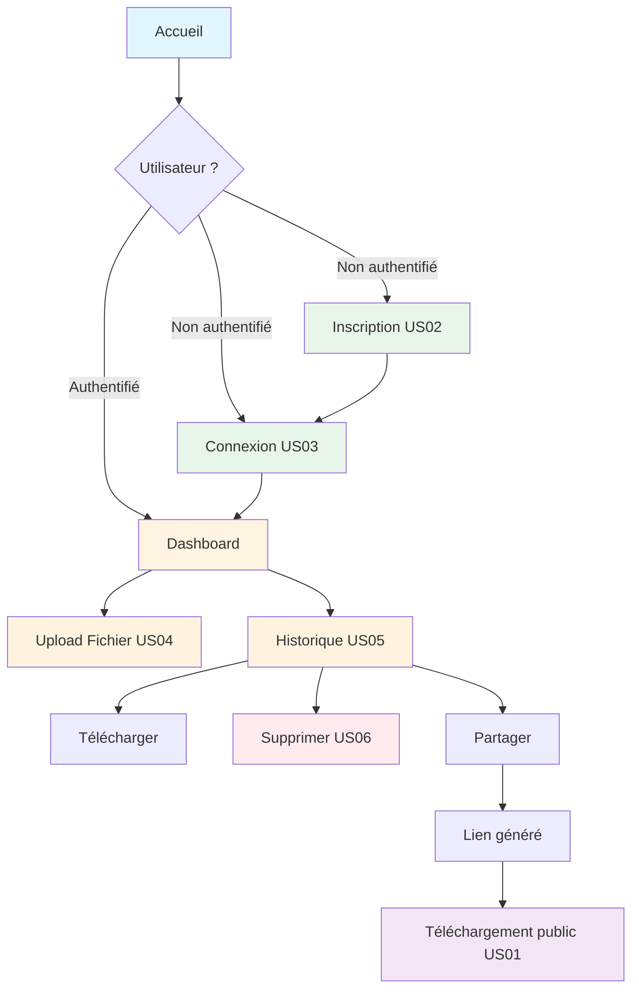

# 🚀 Parcours Utilisateurs - DataShare

## 📋 Vue d'Ensemble

!!! info "À propos des parcours utilisateurs"
    Les parcours utilisateurs décrivent les interactions complètes entre l'utilisateur et l'application, étape par étape, pour accomplir une tâche donnée.

---

## 📚 Parcours utilisateurs critiques

!!! abstract "User Stories disponibles"
    - 📝 **[Création de compte](us02-creation-compte.md)** (US02)  
      _Inscription d'un nouvel utilisateur avec email et mot de passe_
    
    - 🔐 **[Connexion utilisateur](us03-connexion-utilisateur.md)** (US03)  
      _Authentification avec email/mot de passe et génération de JWT_
    
    - 📤 **[Upload de fichier](us04-upload-fichier.md)** (US04)  
      _Upload sécurisé de fichiers avec validation et stockage_
    
    - 📊 **[Consultation de l'historique](us05-consultation-historique.md)** (US05)  
      _Visualisation des fichiers uploadés par l'utilisateur_
    
    - 🗑️ **[Suppression d'un fichier](us06-suppression-fichier.md)** (US06)  
      _Suppression logique ou physique d'un fichier uploadé_
    
    - 🔗 **[Téléchargement via lien](us01-telechargement-lien.md)** (US01)  
      _Téléchargement anonyme d'un fichier partagé via URL publique_

---

## 🔄 Diagramme de Navigation

---

## 📌 Matrice des Fonctionnalités

| User Story | Authentification requise | Rôle requis | Endpoint API | Méthode HTTP |
|------------|-------------------------|-------------|--------------|--------------|
| **US01** - Téléchargement lien | ❌ Non | Aucun | `/api/files/download/{token}` | GET |
| **US02** - Création compte | ❌ Non | Aucun | `/api/auth/register` | POST |
| **US03** - Connexion | ❌ Non | Aucun | `/api/auth/login` | POST |
| **US04** - Upload fichier | ✅ Oui | USER | `/api/files/upload` | POST |
| **US05** - Historique | ✅ Oui | USER | `/api/files/history` | GET |
| **US06** - Suppression | ✅ Oui | USER | `/api/files/{id}` | DELETE |

---

## 🔐 Matrice de Sécurité

!!! warning "Contrôles de sécurité par User Story"
    
    | User Story | Validation | Rate Limiting | Authentification | Autorisation |
    |------------|-----------|---------------|------------------|--------------|
    | **US01** | Validation token | 10 req/min/IP | Non | Token valide |
    | **US02** | Email + Password | 3 comptes/h/IP | Non | - |
    | **US03** | Credentials | 5 tentatives/15min | Non | - |
    | **US04** | Type + Taille fichier | 10 uploads/h/user | JWT | Propriétaire |
    | **US05** | - | 100 req/h/user | JWT | Propriétaire |
    | **US06** | ID fichier | 20 req/h/user | JWT | Propriétaire |

---

